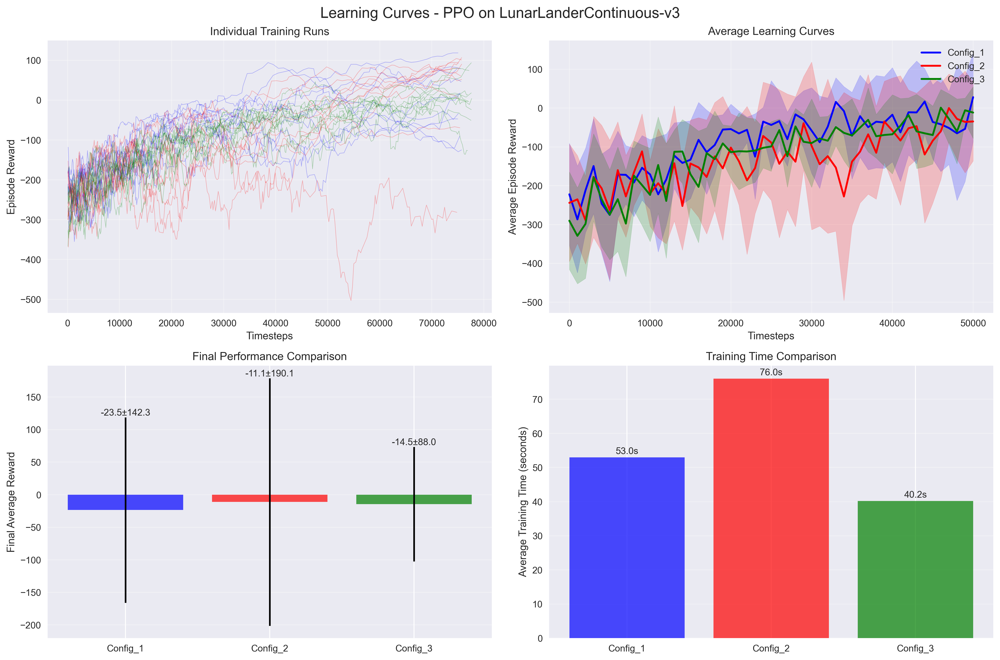
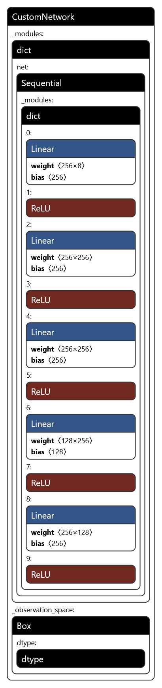
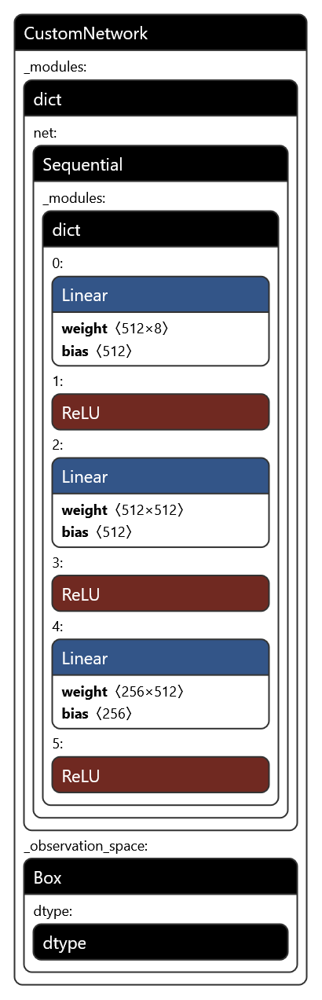
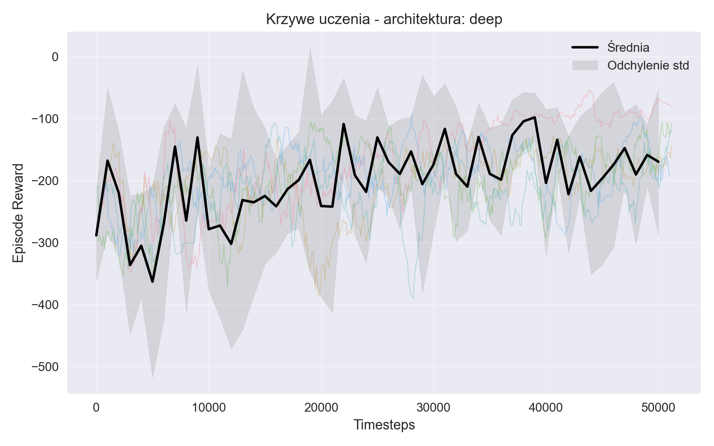
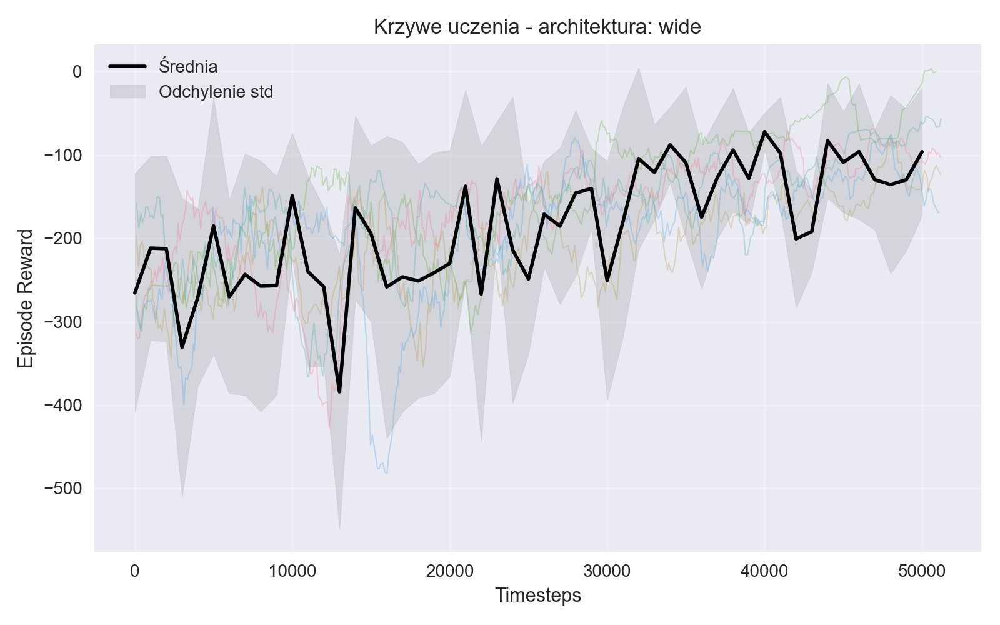

# Projekt 5: Uczenie przez wzmacnianie w przestrzeniach ciągłych

### Autorzy: Maciej Trzaskacz i Mateusz Świątek

## Wprowadzenie

W ramach projektu przeprowadziliśmy eksperymenty z uczeniem przez wzmacnianie w środowisku ze stanami i akcjami ciągłymi, korzystając z biblioteki Gymnasium oraz algorytmów dostępnych w stable-baselines3. Celem było porównanie wpływu różnych zestawów hiperparametrów na efektywność uczenia się agenta.

---

## Zadania na 4 punkty

### Charakterystyka środowiska i algorytmu

Wybranym środowiskiem jest **LunarLanderContinuous-v3** z biblioteki Gymnasium. Jest to zadanie, w którym agent steruje lądownikiem księżycowym, mając do dyspozycji dwa ciągłe silniki. Stan środowiska opisuje wektor ośmiu zmiennych rzeczywistych (pozycja, prędkość, kąt, kontakt z podłożem), a akcje są dwuwymiarowym wektorem z zakresu [-1, 1], odpowiadającym ciągłej mocy silników. Zadanie jest epizodyczne, a nagroda zależy od precyzji lądowania i oszczędności paliwa.

Do uczenia agenta wykorzystaliśmy algorytm **Proximal Policy Optimization (PPO)** z biblioteki stable-baselines3. PPO to nowoczesny algorytm typu policy gradient, który łączy wysoką stabilność uczenia z efektywnością obliczeniową. Wykorzystuje on ograniczenie zmian polityki (klipowanie) oraz estymację przewagi (GAE), co pozwala na skuteczne uczenie się w środowiskach o dużej przestrzeni stanów i akcji.

### Rozważane hiperparametry

W eksperymentach porównaliśmy trzy zestawy hiperparametrów:

- **Config 1**:

  - learning_rate: 0.0003
  - n_steps: 2048
  - batch_size: 64
  - gamma: 0.99
  - gae_lambda: 0.95

- **Config 2**:

  - learning_rate: 0.0001
  - n_steps: 1024
  - batch_size: 32
  - gamma: 0.995
  - gae_lambda: 0.9

- **Config 3**:
  - learning_rate: 0.0005
  - n_steps: 4096
  - batch_size: 128
  - gamma: 0.98
  - gae_lambda: 0.98

Każdy zestaw testowaliśmy w 10 niezależnych uruchomieniach, aby uśrednić wyniki i oszacować odchylenie standardowe.

### Krzywe uczenia

Poniżej przedstawiono krzywe uczenia dla trzech zestawów hiperparametrów. Na osi poziomej znajduje się liczba kroków czasowych, a na osi pionowej średnia nagroda z epizodu. Cieniowanie wokół krzywych przedstawia odchylenie standardowe wyników z 10 uruchomień.

### Czas trwania epizodu

Średni czas treningu dla jednego uruchomienia (75 000 kroków) wynosił odpowiednio:

- **Config 1:** 53.0 s
- **Config 2:** 76.0 s
- **Config 3:** 40.2 s

Czas pojedynczego epizodu zależał od długości epizodu i ustawień hiperparametrów, ale typowo mieścił się w zakresie kilku sekund.

### Analiza wyników

Na podstawie uzyskanych wyników (patrz także raport.txt) można zauważyć, że **Config 2** (learning_rate=0.0001, gamma=0.995, batch_size=32) osiągnął najwyższą średnią końcową nagrodę: **-11.09 ± 190.13**. Pozostałe konfiguracje uzyskały nieco gorsze wyniki: **Config 1**: -23.46 ± 142.32, **Config 3**: -14.46 ± 88.03. Różnice te mogą wynikać z większej stabilności uczenia przy niższym learning rate i wyższym gamma, co sprzyja lepszemu wykorzystaniu długoterminowych nagród. Warto jednak zauważyć, że odchylenia standardowe są duże, co wskazuje na znaczną zmienność wyników między uruchomieniami. Najlepszy pojedynczy wynik osiągnięto również dla Config 2 (199.23).

Podsumowując, **Config 2** okazał się wyraźnie lepszy od pozostałych, choć różnice nie są bardzo duże. Wyniki potwierdzają, że dobór hiperparametrów ma istotny wpływ na efektywność uczenia się agenta w środowiskach ciągłych.

---

## Zadania na 6 punktów

### Test różnych architektur sieci

Przetestowaliśmy dwie różne architektury sieci wykorzystywanych przez agenta PPO:

- **Architektura "deep":**

  - Wejście: 8 wymiarów (obserwacja środowiska)
  - Warstwy: Linear(8, 256) → ReLU → Linear(256, 256) → ReLU → Linear(256, 256) → ReLU → Linear(256, 128) → ReLU → Linear(128, 256) → ReLU
  - Wyjście: 256 wymiarów (cechy przekazywane dalej do polityki i krytyka)
  - Funkcje aktywacji: ReLU po każdej warstwie ukrytej

- **Architektura "wide":**
  - Wejście: 8 wymiarów (obserwacja środowiska)
  - Warstwy: Linear(8, 512) → ReLU → Linear(512, 512) → ReLU → Linear(512, 256) → ReLU
  - Wyjście: 256 wymiarów
  - Funkcje aktywacji: ReLU po każdej warstwie ukrytej

Na wejściu sieci znajduje się wektor obserwacji środowiska (8 liczb rzeczywistych), a na wyjściu wektor cech przekazywany do dalszych warstw polityki i krytyka.

Schematy obu sieci wygenerowane narzędziem netron:

  <b>deep</b>
  <b>wide</b> 
  
  

Poniżej przedstawiono krzywe uczenia dla obu architektur:

**Porównanie wyników:**

- deep: -154.36 ± 79.48
- wide: -133.31 ± 50.03

Architektura "wide" osiągnęła lekko lepsze wyniki końcowe niż "deep".

---

## Zadania na 8 punktów

### Deterministyczna symulacja najlepszego agenta

Stan najlepszego agenta został zapisany po zakończeniu eksperymentów. Następnie przeprowadzono symulację jego działania w trybie deterministycznym (bez eksploracji, agent zawsze wybiera najlepszą znaną akcję). Wyniki tej symulacji:

- **Średnia nagroda:** 218.04 ± 23.02
- **Najlepszy epizod:** 255.27
- **Najgorszy epizod:** 170.73

Dla porównania, średnia nagroda uzyskana podczas uczenia (dla najlepszego zestawu hiperparametrów) wynosiła **-11.09 ± 190.13**. Widać więc, że agent po zakończonym treningu jest w stanie osiągać znacznie wyższe i stabilniejsze nagrody w trybie deterministycznym niż podczas procesu uczenia, gdzie występuje eksploracja i większa zmienność wyników.
