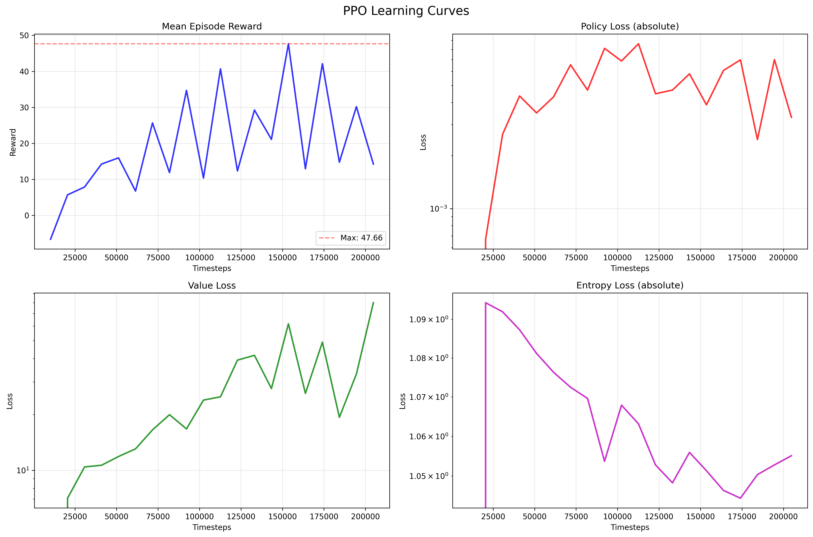

# Sprawozdanie: Uczenie Wieloagentowe w Środowisku Pistonball z wykorzystaniem PPO

## 1. Wprowadzenie

W ramach projektu zaimplementowano system uczenia wieloagentowego dla środowiska **Pistonball v6** z biblioteki PettingZoo, wykorzystując algorytm **Proximal Policy Optimization (PPO)** z biblioteki Stable Baselines 3. Pistonball to kooperacyjne środowisko wieloagentowe, w którym 20 tłoków musi współpracować, aby utrzymać piłkę w powietrzu jak najdłużej.

## 2. Opis Środowiska

### Pistonball v6

Pistonball to fizycznie realistyczne, kooperacyjne środowisko wieloagentowe, w którym celem jest przesunięcie piłki do lewej ściany planszy za pomocą pionowo poruszających się tłoków. Każdy z 20 agentów (tłoków) obserwuje otoczenie w postaci obrazu RGB obejmującego siebie, sąsiadów oraz przestrzeń nad nimi (wraz z piłką). Agenci mogą wykonywać dyskretne akcje (ruch w dół, brak ruchu, ruch w górę) lub ciągłe (proporcjonalny ruch tłoka). Nagroda dla wszystkich agentów jest wspólna i zależy od przesunięcia piłki w lewo w danym kroku oraz kary czasowej, co zachęca do szybkiego rozwiązania zadania. Środowisko korzysta z silnika fizycznego Chipmunk, zapewniając realistyczną symulację ruchu piłki i tłoków.

### Charakterystyka problemu

Środowisko wymaga koordynacji między agentami - każdy tłok musi nauczyć się odpowiedniego pozycjonowania i timingu, aby efektywnie ruszać piłkę. Jest to szczególnie trudne, ponieważ:

- Piłka porusza się w sposób fizycznie realistyczny
- Działania jednego agenta wpływają na pozostałych
- Konieczna jest synchronizacja wszystkich tłoków

## 3. Implementacja

### 3.1 Algorytm PPO (Proximal Policy Optimization)

Wybrano algorytm PPO ze względu na jego:

- **Stabilność**: PPO jest mniej wrażliwy na hiperparametry niż inne algoritmy policy gradient
- **Efektywność próbkowania**: Wykorzystuje dane z wielu kroków jednocześnie
- **Wsparcie dla środowisk wieloagentowych**: Możliwość trenowania jednej polityki dla wszystkich agentów

#### Kluczowe hiperparametry:

```python
model = PPO(
    CnnPolicy,           # Polityka CNN dla danych wizualnych
    env,
    learning_rate=2.5e-4,  # Standardowa wartość dla PPO
    n_steps=128,           # Kroki na rollout na środowisko
    batch_size=256,        # Rozmiar batcha
    n_epochs=4,            # Epoki treningu na rollout
    gamma=0.99,            # Współczynnik dyskontowania
    gae_lambda=0.95,       # GAE lambda
    ent_coef=0.01,         # Współczynnik entropii
    vf_coef=0.5,           # Współczynnik funkcji wartości
)
```

### 3.2 Przetwarzanie Środowiska

Zastosowano szereg wrapperów z biblioteki SuperSuit:

1. **Preprocessing wizualny**:

   ```python
   env = ss.color_reduction_v0(env)        # Redukcja kolorów
   env = ss.resize_v1(env, x_size=64, y_size=64)  # Zmiana rozmiaru
   env = ss.frame_stack_v1(env, 4)         # Stackowanie ramek
   ```

2. **Adaptacja wieloagentowa**:
   ```python
   env = ss.black_death_v3(env)            # Stała liczba agentów
   env = ss.pettingzoo_env_to_vec_env_v1(env)  # Konwersja do formatu SB3
   env = ss.concat_vec_envs_v1(env, num_envs=8)  # Równoległe środowiska
   ```

### 3.3 Monitorowanie Procesu Uczenia

Zaimplementowano niestandardowy callback `LearningCurveCallback` do śledzenia:

- Średnich nagród epizodów
- Strat polityki (policy loss)
- Strat funkcji wartości (value loss)
- Strat entropii (entropy loss)

```python
class LearningCurveCallback(BaseCallback):
    def _on_rollout_end(self) -> None:
        # Zbieranie metryk po każdym rollout
        self.timesteps.append(self.num_timesteps)
        # ... zbieranie nagród i strat
```

## 4. Eksperymenty i Wyniki

### 4.1 Konfiguracja Treningu

- **Całkowite kroki treningu**: 200,000
- **Liczba równoległych środowisk**: 8
- **Maksymalna liczba cykli na epizod**: 125

### 4.2 Wyniki Końcowe

**Metryki treningowe**:

- Końcowa średnia nagroda: **14.47 punktów**
- Maksymalna średnia nagroda: **47.66 punktów**

**Ewaluacja**:

- Średnia nagroda na agenta na grę: **~78 punktów**
- Całkowita suma nagród: **~781 punktów** (wszystkie agenty)
- Konsystentność wyników: Wysoka

## 5. Krzywa Uczenia



## 6. Podsumowanie

Projekt demonstruje skuteczną implementację uczenia wieloagentowego w złożonym środowisku kooperacyjnym. Algorytm PPO okazał się odpowiedni dla tego typu zadań, osiągając stabilne wyniki i wykazując zdolność do nauki koordynacji między wieloma agentami. Implementacja z wykorzystaniem Stable Baselines 3 i SuperSuit umożliwiła efektywne przetwarzanie środowiska PettingZoo i monitoring procesu uczenia.

Wyniki potwierdzają, że nowoczesne algorytmy reinforcement learning mogą być skutecznie zastosowane do rozwiązywania problemów wieloagentowych wymagających współpracy i koordynacji.

---

**Technologie wykorzystane:**

- Python 3.8+
- Stable Baselines 3
- PettingZoo
- SuperSuit
- PyTorch
- TensorBoard
- Matplotlib
