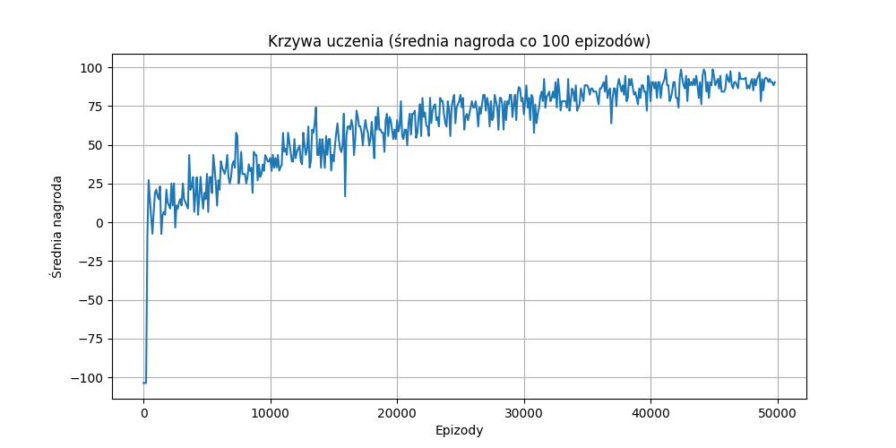
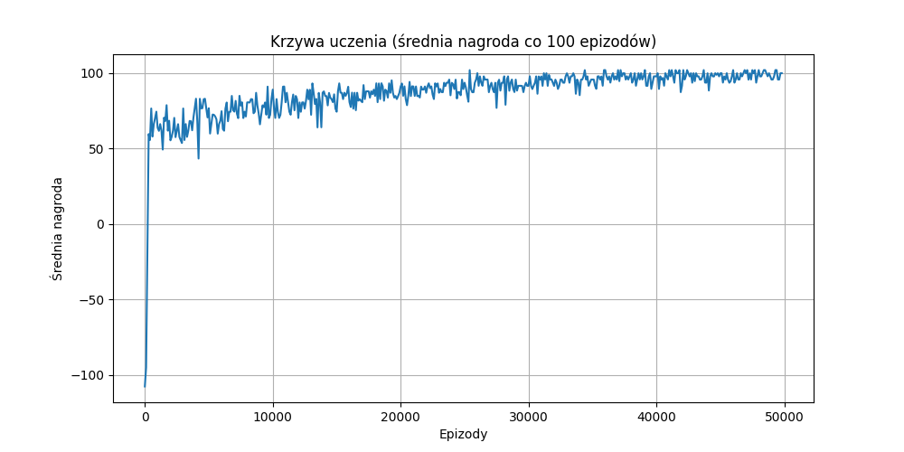
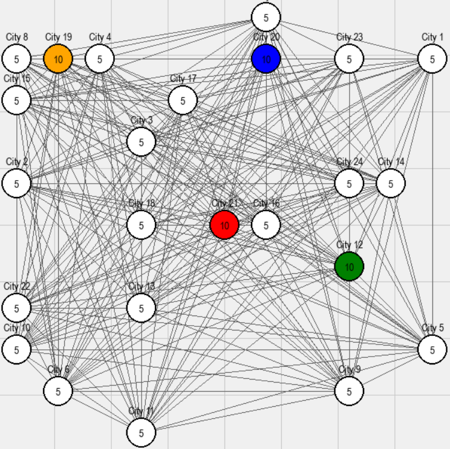

# Gra strategiczna na grafie z uczeniem ze wzmocnieniem

### Autorzy: Maciej Trzaskacz i Mateusz Świątek

## Wprowadzenie

Projekt przedstawia zaawansowaną implementację gry strategicznej w czasie rzeczywistym, która łączy elementy klasycznych gier strategicznych z nowoczesnymi technikami uczenia ze wzmocnieniem. System został zaprojektowany jako środowisko badawcze do testowania algorytmów sztucznej inteligencji w kontekście podejmowania strategicznych decyzji w warunkach niepełnej informacji i ograniczeń czasowych.

Gra opiera się na modelu grafowym, w którym gracze kontrolują miasta rozmieszczone na dwuwymiarowej planszy i konkurują o dominację poprzez strategiczne rozmieszczenie jednostek militarnych oraz koordynację ataków na pozycje przeciwników. Środowisko charakteryzuje się wysokim poziomem złożoności strategicznej, wymagając od uczestników długoterminowego planowania, oceny ryzyka oraz adaptacji do zmieniających się warunków na polu bitwy.

## Mechanika rozgrywki

### Struktura planszy

Plansza gry składa się z miast rozmieszczonych na dwuwymiarowej powierzchni o skończonych wymiarach. Każde miasto posiada unikalne współrzędne kartezjańskie oraz charakteryzuje się trzema podstawowymi atrybutami: liczbą stacjonujących jednostek, przynależnością do określonego gracza lub statusem neutralnym, oraz maksymalną pojemnością jednostek. Miasta połączone są grafem pełnym, co oznacza że każde miasto może komunikować się bezpośrednio z każdym innym miastem na planszy.

### System produkcji jednostek

Miasta funkcjonują jako centra produkcji jednostek militarnych, generując automatycznie nowe siły z każdym krokiem temporalnym gry. Mechanizm produkcji zależy od statusu własnościowego miasta - miasta należące do aktywnych graczy mogą produkować maksymalnie pięćdziesiąt jednostek, podczas gdy miasta neutralne ograniczone są do dziesięciu jednostek. System ten wprowadza element gospodarczy do rozgrywki, wymagając od graczy strategicznego zarządzania zasobami oraz planowania ekspansji w oparciu o potencjał produkcyjny kontrolowanych terytoriów.

### System walki i podboju

Po dotarciu do miasta docelowego armie wykonują jedną z dwóch akcji: w przypadku miasta przyjaznego jednostki zostają włączone do lokalnej garnizonu, wzmacniając obronę pozycji; w przypadku miasta wrogiego następuje bezpośrednie starcie, w którym przewaga liczebna decyduje o sukcesie operacji. Miasto zostaje podbite gdy atakujące siły przewyższają liczebnie obronę, przejmując kontrolę nad pozycją oraz pozostawiając nadwyżkę jednostek jako nowy garnizon.

## Architektura techniczna

### Przestrzeń akcji

Przestrzeń akcji zostały zaprojektowana jako dyskretna, obejmująca wszystkie możliwe kombinacje miast źródłowych i docelowych dla przemieszczenia jednostek. Dodatkowo dostępna jest akcja passa, pozwalająca graczowi na świadome przekazanie tury bez wykonywania ruchu. Łączna liczba dostępnych akcji wynosi 2n(n-1)+1, gdzie n reprezentuje liczbę miast na planszy. Struktura ta zapewnia pełną swobodę strategiczną przy zachowaniu obliczalnej złożoności dla algorytmów uczenia.

### Przestrzeń obserwacji

Przestrzeń obserwacji została skonstruowana jako złożona struktura słownikowa zawierająca kompletne informacje o stanie gry. Komponenty obserwacji obejmują rozkład jednostek w poszczególnych miastach oraz informacje o właścicielach wszystkich pozycji na planszy.

### System wizualizacji

Komponent wizualizacji wykorzystuje bibliotekę PyGame do renderowania stanu gry w czasie rzeczywistym. Miasta przedstawiane są jako kolorowe okręgi, których barwa odpowiada przynależności do gracza, z wyraźnie oznaczoną liczbą stacjonujących jednostek.

## Algorytm uczenia ze wzmocnieniem

### Implementacja Q-learning

Projekt zawiera zaawansowaną implementację agenta Q-learning specjalnie dostosowaną do dyskretnej przestrzeni akcji środowiska gry. Algorytm wykorzystuje tabelaryczną reprezentację funkcji wartości, gdzie każdy stan gry serializowany jest do postaci hashowalnej struktury danych umożliwiającej efektywne przechowywanie oraz wyszukiwanie wartości Q. Implementacja uwzględnia standardową regułę aktualizacji Bellmana z konfigurowalnymi parametrami współczynnika uczenia oraz współczynnika dyskontowego.

### Strategia eksploracji

Agent implementuje strategię epsilon-greedy do równoważenia eksploracji przestrzeni stanów z eksploatacją wyuczonej wiedzy. Wartość epsilon podlega stopniowej redukcji w trakcie procesu treningu zgodnie z harmonogramem wykładniczym, zapewniając intensywną eksplorację w początkowych etapach uczenia oraz stopniowe przejście do eksploatacji w miarę stabilizowania się polityki. Mechanizm ten zostaje dostrojony do specyfiki środowiska, uwzględniając długość epizodów oraz złożoność przestrzeni stanów.

### Serializacja stanów

System implementuje zaawansowaną metodę serializacji stanów gry do postaci umożliwiającej efektywne indeksowanie w tablicy Q. Proces serializacji uwzględnia właścicielów miast oraz liczbę jednostek w każdym z nich. Implementacja zapewnia determinizm oraz odporność na błędy, gwarantując identyczną serializację dla identycznych stanów gry.

### Wykresy uczenia

Przykładowy wykres uczenia - 16 miast i dwóch graczy

Przykładowy wykres uczenia - 32 miasta i czterech graczy

## Funkcjonalności interakcji z człowiekiem

### Interfejs graficzny

System udostępnia intuicyjny interfejs graficzny umożliwiający komfortową rozgrywkę przez graczy ludzkich. Interakcja opiera się na systemie wskaźnikowym, gdzie gracze wybierają miasta poprzez kliknięcie lewym przyciskiem myszy oraz wydają rozkazy przemieszczenia jednostek poprzez wskazanie miasta docelowego. Wybrane miasto zostaje wyróżnione charakterystyczną żółtą obwódką, zapewniając natychmiastową informację zwrotną o aktualnym stanie selekcji.

### System informacyjny

Interfejs udostępnia rozbudowany panel informacyjny prezentujący szczegółowe dane o wybranym mieście, włączając współrzędne pozycji, przynależność do gracza oraz aktualną liczbę stacjonujących jednostek. Panel aktualizowany jest dynamicznie w odpowiedzi na działania gracza, zapewniając dostęp do aktualnych informacji strategicznych niezbędnych do podejmowania świadomych decyzji.

## Konfiguracja i parametryzacja

### Parametry środowiska

System udostępnia rozbudowany zestaw parametrów konfiguracyjnych umożliwiających dostosowanie środowiska do specyficznych wymagań badawczych. Kluczowe parametry obejmują rozmiar planszy, liczbę miast, maksymalną pojemność jednostek, współczynniki produkcji oraz nasienie generatora liczb pseudolosowych dla zapewnienia reprodukowalności eksperymentów. Dodatkowo możliwa jest konfiguracja liczby graczy, rozmiarów okna wizualizacji oraz częstotliwości renderowania.

### Parametry algorytmu uczenia

Implementacja Q-learning udostępnia pełną kontrolę nad hiperparametrami algorytmu, włączając współczynnik uczenia, współczynnik dyskontowy, strategię eksploracji oraz harmonogram redukcji parametru epsilon. System umożliwia również konfigurację kryteriów zakończenia treningu, częstotliwości ewaluacji oraz mechanizmów zapisu stanu agenta dla celów analizy post-hoc.
